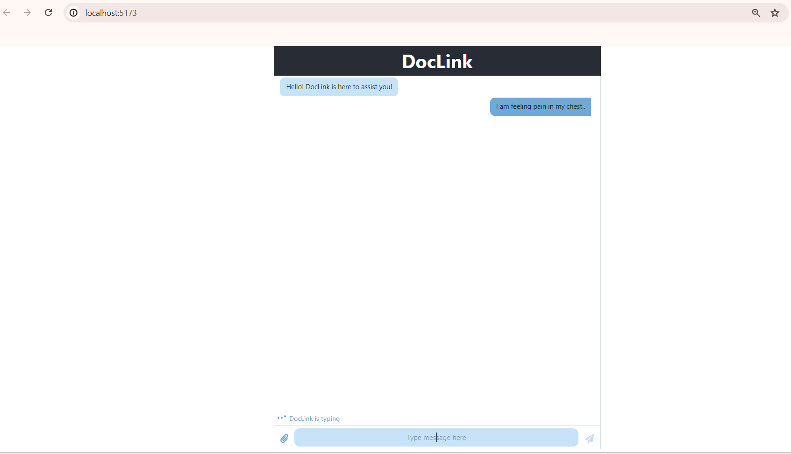

# Project Documentation

Welcome to the project folder. This README provides an overview of the contents and purpose of each file.

## Folder Contents

1. **data/**: Contains all the datasets used in the project.
2. **scripts/**: Includes all the scripts for data processing, analysis, and visualization.
3. **notebooks/**: Jupyter notebooks used for exploratory data analysis and model building.
4. **reports/**: Generated reports and documentation.
5. **results/**: Final results, including model outputs and evaluation metrics.
6. **references/**: Any additional references or resources used in the project.
7. **figures/**: Visualizations and figures generated during the analysis.

## Getting Started

To get started with the project, follow these steps:

1. **Clone the repository**: 
    ```bash
    git clone <repository-url>
    ```
2. **Navigate to the project directory**:
    ```bash
    cd project-directory
    ```
3. **Install the required dependencies**:
    ```bash
    pip install -r requirements.txt
    ```
### Screenshot



## Usage

Detailed usage instructions and examples can be found in the `notebooks/` and `scripts/` directories. Each script and notebook is well-documented with comments explaining the code and its functionality.

## Contributing

If you would like to contribute to this project, please follow these steps:

1. Fork the repository.
2. Create a new branch (`git checkout -b feature-branch`).
3. Commit your changes (`git commit -m 'Add some feature'`).
4. Push to the branch (`git push origin feature-branch`).
5. Create a new Pull Request.

## License

This project is licensed under the MIT License. See the `LICENSE` file for details.

## Contact

For any questions or inquiries, please contact the project maintainers.

---

Thank you for using this project. We hope you find it helpful and informative.
